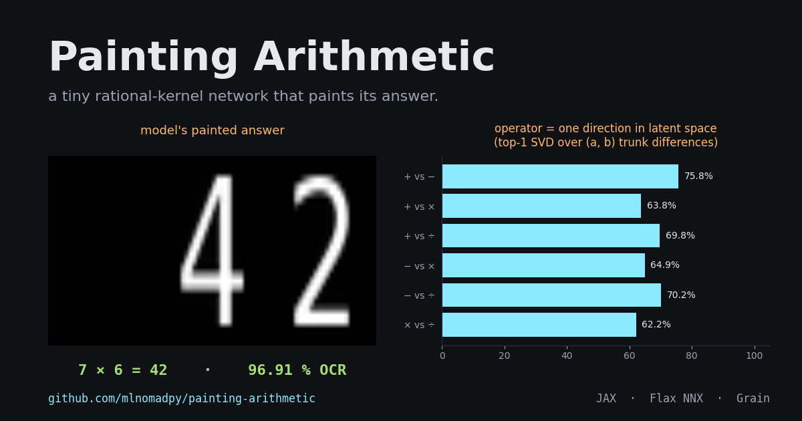
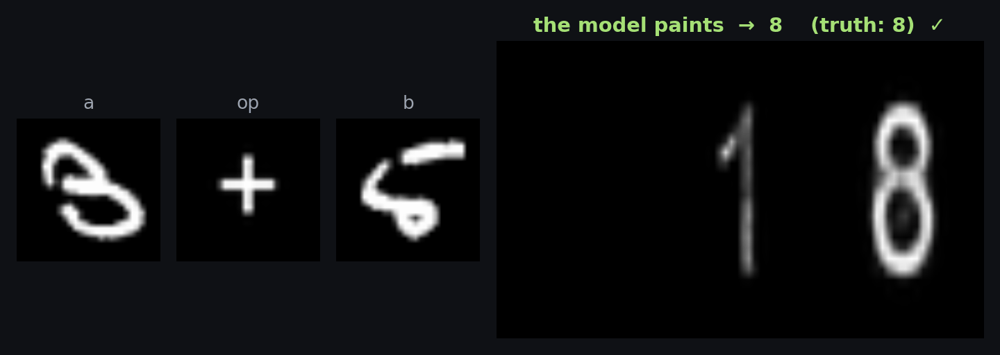
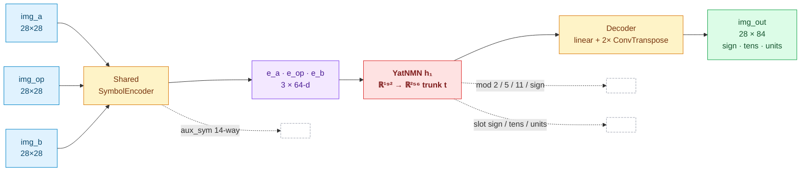

<div align="center">

# Painting Arithmetic 🎨



### A neural calculator that computes in **visual latent space only**.

Three images go in (digit, operator, digit) &middot; one image comes out, painted pixel by pixel. <br>
No softmax over result classes. No symbolic readout inside the network. The number you read is the model's last layer.

<br>

[](https://mlnomadpy.github.io/painting-arithmetic/)
[](https://www.kaggle.com/code/skywolfmo/painting-arithmetic-neural-calculator-with-jax)
[](https://arxiv.org/abs/2605.03262)
[](https://github.com/azettaai/nmn)

<br>


</div>

<br>

<p align="center">
  
</p>

---

## Table of contents

- [Why this exists](#why-this-exists)
- [Headline numbers](#headline-numbers)
- [Key interpretability findings](#key-interpretability-findings)
- [Install &middot; Train &middot; Evaluate](#install)
- [Notebook (Kaggle)](#try-in-a-notebook)
- [Live demo: seven knowledge-removal interventions](#live-demo)
- [Architecture](#architecture)
- [How it was built (the four phases)](#how-it-was-built)
- [Repository layout](#repository-layout)
- [Citation](#citation)

---

## Why this exists

Almost every neural arithmetic system trains a classifier over result classes and stops there. This one does the opposite: it puts the answer in *image space* and trains a 256-d latent vector to organise itself well enough to be painted. Because the trunk is small and symbolically supervised, the entire interior is legible &mdash; you can look at it, probe it, and edit it. The demo lets you do all three live.

```
img_a   (28×28 MNIST digit)   ─┐
img_op  (28×28 operator glyph) ─┼──► [shared encoder] ──► Yat trunk ──► [decoder]
img_b   (28×28 MNIST digit)   ─┘                                              │
                                                                              ▼
                                                                  img_out  (28×84)
                                                                  [ sign | tens | units ]
```

---

## Headline numbers

<sub>v3.1, 25 epochs &middot; single seed (0) &middot; ±0.3 OCR points across seeds.</sub>

| metric | value |
|---|---:|
| OCR test accuracy | **96.91 %** |
| 14-way input-symbol recognition | 99.3 % |
| Robust to operator glyph noise | 96.78 % |
| Parameters | 0.81 M |
| Training time | ≈ 13 min on Apple-Silicon MPS &middot; ≈ 3 min on a Kaggle T4 |

Per-operator (single-digit operands, results in `[−9, 81]`):

| op | OCR | mod 2 | mod 5 | mod 11 |
|:---:|---:|---:|---:|---:|
| `+` | 96.2 % | 97.0 % | 93.0 % | 93.0 % |
| `−` | 96.0 % | — | — | — |
| `×` | 97.1 % | — | — | — |
| `÷` | 98.3 % | — | — | — |

---

## Key interpretability findings

> The trunk between encoder and decoder is **only 256-d and supervised symbolically** (per-slot CE on sign / tens / units + CRT residues). That makes the interior legible.

- **Operator regions in latent space.** PCA of the post-`h₁` trunk shows the four operators occupy four distinct regions and, inside each region, the integer result moves smoothly along a direction. The trunk has learned a value line per operator.
- **Operator-as-shift.** For every pair of operators, the top singular value of the trunk-difference matrix across the 10×10 `(a, b)` grid captures **62–76 %** of the variance. The difference between any two operators is dominated by *one direction* in the 256-d trunk &mdash; a small-model reproduction of the "geometric calculator" pattern found by [Goodfire AI](https://www.goodfire.ai/research/a-geometric-calculator) inside Llama 3.1-8B.
- **Slot-localised painter units.** Pushing one-hot vectors through the trained decoder yields a per-unit "footprint" image. Many trunk units are dedicated *sign-slot painters*, *tens-slot painters*, or *units-slot painters* &mdash; the decoder has carved itself into a slot alphabet.
- **Yat prototypes are interpretable.** Each row of `h₁`'s weight matrix splits into three 64-d slots that match the three encoder embeddings. About **20 % of `h₁` units** have an operator-class prototype in their middle slot &mdash; those are the operator-conditioned arithmetic units.

The full dashboard is reproduced in [`docs/blog.md`](docs/blog.md).

---

## Install

```bash
git clone https://github.com/mlnomadpy/painting-arithmetic.git
cd painting-arithmetic
pip install -e .
```

## Train

<details>
<summary><b>Phased curriculum (default)</b> &middot; three stages with <code>stop_gradient</code> cuts</summary>

```bash
#   phase 1 — encoder + aux_sym             (CE on 14 symbols)
#   phase 2 — frozen encoder, train trunk   (CE on modular + per-slot heads)
#   phase 3 — frozen encoder + trunk        (BCE on the painted target image)
painting-arithmetic-train --phase all --epochs-1 8 --epochs-2 15 --epochs-3 8
```
</details>

<details>
<summary><b>Single-stage runs</b> &middot; phase 2/3 auto-load the prior phase's ckpt</summary>

```bash
painting-arithmetic-train --phase 1 --epochs 8
painting-arithmetic-train --phase 2 --epochs 15
painting-arithmetic-train --phase 3 --epochs 8
```
</details>

<details>
<summary><b>Legacy joint training</b> &middot; single pass, all heads at once</summary>

```bash
painting-arithmetic-train --phase joint --epochs 25 --train-size 60000
```
</details>

<details>
<summary><b>YatConv encoder</b> &middot; experimental, currently underperforms stock</summary>

```bash
painting-arithmetic-train --phase all --yat-encoder
```
</details>

Per-phase checkpoints are written to `ckpts/phase{1,2,3}.npz`; the final model is also copied to `ckpts/model.npz` for the demo and eval scripts.

## Evaluate a checkpoint

```bash
painting-arithmetic-eval --ckpt ./ckpts/model.npz --test-size 10000
```

---

## Try in a notebook

<a href="https://www.kaggle.com/code/skywolfmo/painting-arithmetic-neural-calculator-with-jax">
  
</a>

Full training + interpretability walkthrough on a free Kaggle T4. Or locally:

```bash
jupyter notebook notebooks/painting_arithmetic.ipynb
```

---

## Live demo

<a href="https://mlnomadpy.github.io/painting-arithmetic/">
  
</a>

Three drawing pads, in-browser ONNX inference (no server), and **seven knowledge-removal interventions** that edit the 256-d trunk vector `t` between encoder and decoder:

| # | intervention | what it does |
|:--:|---|---|
| 1 | **unit lesion grid** | click any of 256 cells to set `t[u] = 0` |
| 2 | **operator-circuit lesion** | zero every trunk unit tagged to one operator |
| 3 | **random vs surgical baseline** | for the same N, purity-ranked beats random |
| 4 | **cumulative purity slider** | progressively kill the top-k most operator-pure units |
| 5 | **input-slot blinding** | black out the A, op, or B image |
| 6 | **INLP per-op erasure** | project `t` orthogonal to one operator's centroid direction |
| 7 | **rank-k subspace erasure** | project out the top-k singular directions of the operator subspace (`k = 3` makes `+` and `×` produce the same painted answer) |

The split ONNX (`demo/encode.onnx` → trunk → `demo/decode.onnx`) plus the offline interp assets (`op_units.json`, `op_directions.json`) live in [`demo/`](demo/). To rebuild from a fresh checkpoint:

```bash
python scripts/export_onnx.py        --ckpt ./ckpts/model.npz --split  # encode.onnx + decode.onnx
python scripts/compute_interp_assets.py                                # purity tags + INLP basis
```

See [`demo/README.md`](demo/README.md) for deployment options (GitHub Pages, Hugging Face Spaces, Cloudflare Pages).

---

## Architecture



- **Encoder.** Shared across all three input slots. Two variants &mdash; `StockEncoder` (stock `Conv + GELU`, **default and validated** at 96.91 % OCR) or `YatEncoder` (every conv is a `YatConv` rational kernel; experimental, currently underperforms at the same recipe). Both end with global average pool → linear → 64-d embedding.
- **Trunk.** A single `YatNMN` layer (`192 → 256`) &mdash; the "v3-thin" single-Yat variant used for interpretability and shipped in the demo. The Yat kernel computes <code>α(x·W + b)² / (‖x − W‖² + ε)</code>, which makes each row of `W` a literal prototype point in input space. That's what makes the prototype-gallery interpretability work. (A two-layer trunk variant exists behind `--phase joint` without `--single-yat` but is not the deployed model.)
- **Decoder.** Linear projection → 16×7×21 feature map → two `ConvTranspose` upsamples → `Conv → sigmoid` → 28×84 image.
- **Auxiliary heads (training only).** A 14-way symbol classifier on each input embedding; modular CRT classifiers (mod 2, mod 5, mod 11, sign) on the trunk; per-slot classifiers (sign, tens, units) on the trunk. The per-slot CE is the load-bearing fix for the multi-digit collapse failure mode &mdash; removing it costs about 34 OCR points.

<details>
<summary><b>Loss decomposition</b></summary>

```
L = BCE(img_pred, target) × tens_pixel_weight    [headline, BCE with 2× weight on tens column]
  + 0.5  · CE(sign-slot, tens-slot, units-slot)  [load-bearing — the multi-digit fix]
  + 0.05 · CE(mod 2, mod 5, mod 11, sign)        [Chinese-Remainder-Theorem prior]
  + 0.2  · CE(sym_a, sym_op, sym_b)              [shared-encoder regulariser]
```

</details>

---

## How it was built

The project went through four phases. Each one set up the next.

### 1 &middot; Build the painter

> **Goal.** A network that takes three images and *paints* the answer, with no symbolic readout inside the model.

The first attempts trained everything jointly with one BCE loss on the output image. Multi-digit results (e.g. `7 × 8 = 56`) collapsed: the model would paint the units column correctly and either skip the tens column or smear it. Per-slot cross-entropy heads on the trunk (`sign`, `tens`, `units`) fixed it; removing them costs about 34 OCR points.

The current recipe runs three phases with `stop_gradient` cuts so pixel supervision cannot leak into the encoder or the trunk:

| phase | trains | supervised by | epochs |
|:---:|---|---|---:|
| 1 | encoder + `aux_sym` | CE on 14 input symbols | 8 |
| 2 | trunk (encoder frozen) | CE on CRT residues + per-slot CE | 30 |
| 3 | decoder (encoder + trunk frozen) | BCE on the painted target image | 12 |

That separation is what makes the trunk legible afterwards: it is shaped by symbolic supervision, not by pixel error.

### 2 &middot; Probe the trunk

> **Goal.** Read the 256-d trunk vector `t` like an annotated atlas.

- PCA on `t` over the 4 × 10 × 10 grid of `(op, a, b)` shows four operator-specific regions, each with a smooth value line in the integer result.
- For every pair of operators, the trunk-difference matrix across `(a, b)` is rank-1 to first order: the top singular value captures 62 to 76 percent of variance, mirroring the "geometric calculator" finding from Goodfire AI in Llama 3.1-8B.
- Pushing one-hot trunk vectors through the trained decoder yields per-unit "footprint" images. Most units paint into a fixed column (sign / tens / units), so the decoder has carved itself into a slot alphabet.
- Inspecting `h₁`'s weight matrix row by row: every row splits into three 64-d slots aligned with the three encoder embeddings (`e_a`, `e_op`, `e_b`). About 20 percent of units carry an operator-class prototype in their middle slot.

### 3 &middot; Edit the model

> **Goal.** Do surgery on the model with math, not retraining.

- `experiments/intervene.py`: zero the kernel columns of operator-tagged units in `h₁` (the single Yat trunk layer). RKHS-preserving weight edits that delete one operator while keeping the others.
- `scripts/compute_interp_assets.py`: tag each of the 256 trunk units by which operator activates it most purely (on the offline `(op, a, b)` grid), and compute the four operator centroids + their SVD basis for INLP-style concept-erasure projections.

### 4 &middot; Make it interactive

> **Goal.** Move every intervention into a browser so you can watch the model forget.

The final phase split the exported ONNX in two: `encode.onnx` (three images → `t[256]`) and `decode.onnx` (`t[256]` → `28 × 84` image). Every intervention then becomes a tensor edit on `t` in JavaScript, which is what the seven panels in the [live demo](https://mlnomadpy.github.io/painting-arithmetic/) do. No server, no per-intervention re-export, no checkpoint required at inference time.

---

## Repository layout

<details>
<summary><b>Click to expand</b></summary>

```
painting-arithmetic/
├── README.md                      ← you are here
├── pyproject.toml                 ← `pip install -e .`
├── src/painting_arithmetic/
│   ├── glyphs.py                  ← font-aware symbol + result-image rendering
│   ├── data.py                    ← Grain pipeline (sampling + collation)
│   ├── model.py                   ← NNX module (encoder + trunk + decoder)
│   ├── losses.py                  ← BCE + slot CE + modular CE + symbol CE
│   ├── train.py                   ← CLI training script + library API
│   ├── eval.py                    ← OCR metric, per-op breakdown, checkpoint loader
│   └── viz.py                     ← trunk PCA, op-as-shift SVD, decoder atlas, prototype gallery
├── notebooks/
│   └── painting_arithmetic.ipynb  ← Kaggle-ready tutorial
├── docs/
│   └── blog.md                    ← long-form blog post
├── experiments/
│   ├── intervene.py               ← h₁ weight ablation (RKHS-preserving)
│   └── circuit/                   ← Gram, MI, geometry, steering, Jacobian probes
├── demo/
│   ├── index.html                 ← three pads + live ONNX + seven interventions
│   ├── encode.onnx                ← 3 images → trunk t[256]
│   ├── decode.onnx                ← t[256] → painted image
│   ├── op_units.json              ← per-op purity-ranked unit tags
│   ├── op_directions.json         ← centroids + INLP basis for erasure
│   └── README.md
├── scripts/
│   ├── export_onnx.py             ← JAX → ONNX export (split or monolithic)
│   └── compute_interp_assets.py   ← rebuild op_units.json + op_directions.json
└── tests/
```

</details>

---

## Citation

<details>
<summary><b>BibTeX</b></summary>

```bibtex
@misc{bouhsine2026painting,
  title         = {Painting Arithmetic: A Rational-Kernel Network for Visual Symbolic Computation in Latent Space},
  author        = {Bouhsine, Taha},
  year          = {2026},
  eprint        = {2605.03262},
  archivePrefix = {arXiv},
  primaryClass  = {cs.LG},
  url           = {https://arxiv.org/abs/2605.03262},
}
```

</details>

The Yat rational-kernel layer comes from the [`nmn`](https://github.com/azettaai/nmn) library, which exposes it under PyTorch / Flax NNX / Flax Linen / TensorFlow / Keras / MLX backends.

---

## License

[MIT](LICENSE).

<br>

<div align="center">
<sub>Built with <a href="https://github.com/jax-ml/jax">JAX</a> &middot; <a href="https://github.com/google/flax">Flax NNX</a> &middot; <a href="https://github.com/google/grain">Grain</a> &middot; <a href="https://github.com/azettaai/nmn">nmn</a> &middot; <a href="https://onnxruntime.ai/docs/tutorials/web/">ONNX Runtime Web</a></sub>

<br>

<a href="https://mlnomadpy.github.io/painting-arithmetic/"></a>
<a href="https://www.kaggle.com/code/skywolfmo/painting-arithmetic-neural-calculator-with-jax"></a>
</div>
